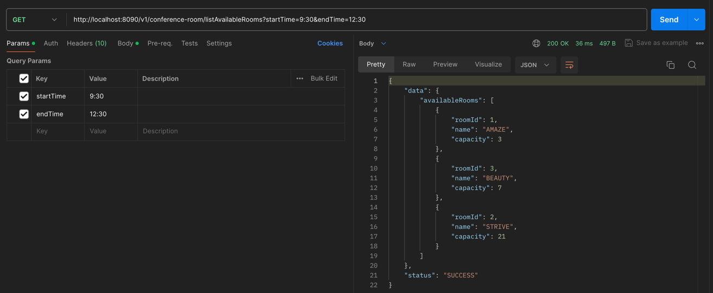
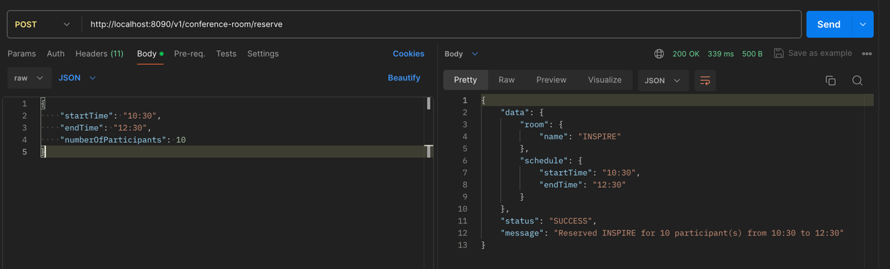
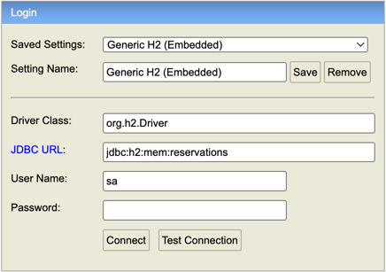
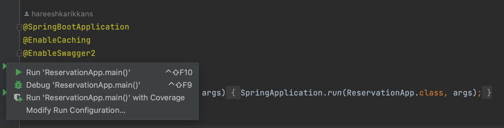

# reservation-service

A lightweight microservice designated to reserve conference room for a given number of participants and time slots.
- The application maintains the record of rooms which the user can book (configured in master table). 
- It keeps the schedules of room maintenance (configured in application properties). 
- The service looks for a suitable room for the number of participants (optimal) on a first-come first-serve (FCFS) basis considering
the existing reservations and the maintenance schedule.
- The service provides a feature of viewing the available rooms for a given time slot

## Technical Specification
### Technical Stack
- Spring Boot - 2.7.18
- Java 11.x
- Maven 3.x
- H2 Database 2.x
- Swagger 2
- Junit 4.x

### API Specification

#### Application APIs
##### Conference Room Reservation (Use Swagger UI for more details)
- http://localhost:8090/v1/conference-room/listAvailableRooms?startTime=<startTime>&endTime=<endTime>

- http://localhost:8090/v1/conference-room/reserve

##### User Authorization & Authentication APIs (Use Swagger UI for more detail)
- http://localhost:8080/v1/auth/sign-up
- http://localhost:8080/v1/auth/login

#### Supporting APIs (Integrated)
- Swagger UI - http://localhost:8090/swagger-ui/
- Swagger Docs - http://localhost:8090/v2/api-docs
- H2 DB Console - http://localhost:8090/h2-console \

### Assumptions & Details
#### Assumptions
- The booking can be done only during an allowed period. Values are configurable and read from application yaml.\
  &nbsp; Refer to <b>reservation.minimumStartTime</b> in application yaml\
  &nbsp; Refer to <b>reservation.maximumEndTime</b> in application yaml
- Dates are not considered in the APIs as the requirement is to reserve conference room for the current date.

#### Implementation Details
- The reservation APIs can be with or without authorization based on the security flag configured in application yaml.\
  &nbsp; - Refer to <b>app.security.enabled</b> in application yaml\
  &nbsp; - If security is enabled, then reservation APIs can be invoked only after user registration.\
  &nbsp; - /sign-up API should be invoked to register first and then use the token (bearer) in registration APIs.\
  &nbsp; - /login API can be used to generate fresh token in order to invoke APIs in case of token expiry.
- Master table data is insert into the table using application start up (Refer to data.sql file in src/main/resources)
- The combination of room id, start and end time are taken as a unique key in reservation table to ensure the consistency of reservation

### How to run the service
The application can be run either via command line or IDE such as IntelliJ/Eclipse/STS if it meets the java and maven specification mentioned above.\
#### Using Command line
- Build & Test : mvn clean install
- Run the app: mvn spring-boot:run

#### Using IDE (IntelliJ Spec)
- Click on Run or Debug option in the main class (ReservationApp)\

  